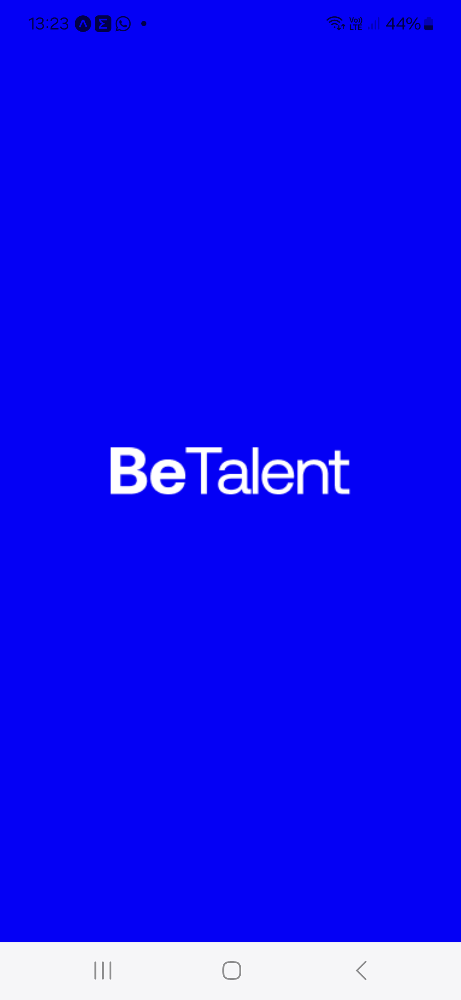

# BeTalentCollaborators
Tarefa mostrando os funcionários da Be Talent usando React-Native com typescript.

## SplashScreen

Tela inicial de splash screen usando expo-splash-screen

  
  <pre>
    <code>
    // app.json
    {
      "expo": {
        "splash": {
          "image": "./assets/logo.png",
          "resizeMode": "contain",
          "backgroundColor": "#0500ff"
        },
      }
    }
    </code>
  </pre>

## Ícones
Usando as bibliotecas para renderizar ícones do asstes baixados do Figma:
- [react-native-svg](https://github.com/software-mansion/react-native-svg)
- [react-native-svg-transformer](https://www.npmjs.com/package/react-native-svg-transformer)
